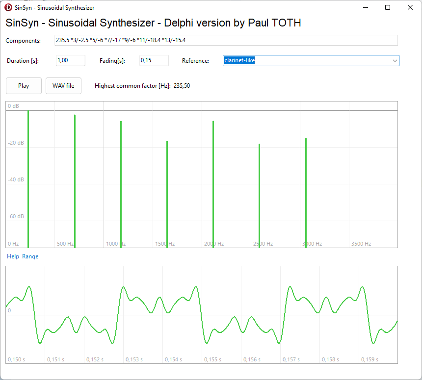

# Delphi-SinSyn
Delphi version of Javascript SinSyn

you can look at the Javascript version for [details](https://www.source-code.biz/sinSyn/).

this project was made under Delphi 11.1

todo

 - [X] generate Wav sound
 - [X] show graphs
 - [ ] interactives graphs
 - [ ] save new settings

